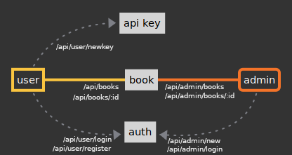

## fiber-gorm-api
### SUMMARY
This is a REST API where user can find a book (or books), and admin can find, add, modify, and delete a book(s) from it.

### Features
- Admin CRUD
- User read-only
- User & admin auth
- User API key
- Repository pattern structure

### Stack Used
- Fiber v2.43.0
- GORM v1.24.6
- [Validator](https://github.com/go-playground/validator)
- godotenv
- MariaDB

### How It Works
User needs to send API key in request header to be able to use the API. To get the API key, they need to login first. After user got the key, they need to put it inside `X-Api-Key` in request header.

Admin needs to login to be able to use the API. Admin doesn't need API key to use it.

Users and admins will get `authentication cookies` whenever they logged in. The cookie will be checked by auth middleware whenever they access restricted routes.